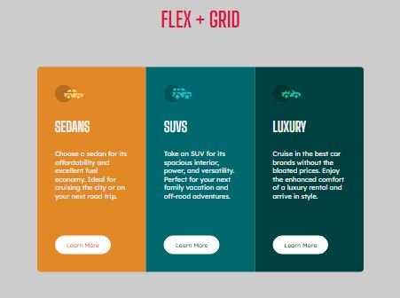
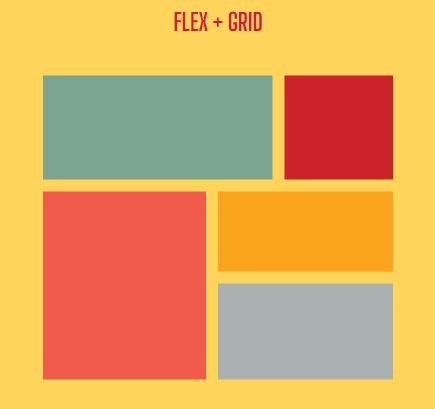

# FLEX AND GRID
Both pages were built using Flex and Grid respectively and both are mobile responsive

## LANGUAGES USED
* HTML
* CSS

## PROCESSES USED
* Media Queries
* Flexbox
* Grid

---

## Screensot




## LIVE SITE
[Flex and Grid](https://imrvon.github.io/flex-and-grid/)

---
### RESOURCES
* This tutorial by [Kevin Powell on YouTube](https://www.youtube.com/watch?v=rg7Fvvl3taU) introduced me to Grids and I immediately loved the Grid Areas solution. Pretty straightforward.


### WHAT'S NEW
* Learned how to align flex items in a box to have the same size using:
```css
flex: 1 1 0;
align-self: stretch;
```
* Used Grid Areas for the first time and loved it.
* Also enjoyed using specific border radius (top left, top right, bottom left, bottom right) for the first time.
* Saw the responsiveness of the Flex layout without making use of media queries.